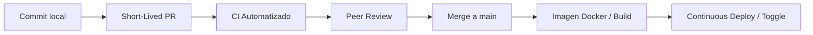

# 📘 Scrum + TBD Playbook
> **Adaptación de Scrum a entornos de Despliegue Continuo y Trunk-Based Development (TBD)**  
> *Artefacto vivo y operativo de trabajo en equipo*

---

## 🎯 1. Propósito y Contexto
Este Playbook establece los acuerdos de trabajo, responsabilidades, adaptación de ceremonias y criterios de calidad para que el equipo opere bajo el marco **Scrum** alineado con **Trunk-Based Development (TBD)** y **Despliegue Continuo (CD)**.

* **Objetivo:** Garantizar que la rama `main` esté **siempre verde, estable y potencialmente desplegable (releasable)** en cualquier momento, reduciendo los tiempos de ciclo y eliminando el miedo al despliegue.

---

## 🚦 2. Diagnóstico del Flujo Actual (Mapa de Fricciones)
*Dinámica inicial del taller para identificar cuellos de botella y áreas de mejora.*



### Semáforo de Salud del Flujo
| Estado | Elemento del Flujo | Observaciones / Aprendizajes |
| :--- | :--- | :--- |
| 🟢 **Funciona Bien** | Commits locales frecuentes, tests automáticos y Docker build | Commits frecuentes locales, tests unitarios automáticos y build de imagen Docker en CI. |
| 🟡 **Genera Fricción** | Ramas de larga duración | Ramas de larga duración alejadas de main acumulando riesgo. |
| 🔴 **Rompe Flujo / Miedo** | Cuello de botella en autorizaciones de merge | Cuello de botella por dependencia exclusiva de la aprobación del Administrador para autorizar merges a main. |

> **Preguntas Clave del Equipo:**
> 1. *¿Cuánto tiempo vive normalmente una rama de desarrollo en nuestro repo?* (Meta TBD: `< 24 horas`).
> 2. *¿Qué tan seguido integramos realmente a `main`?* (Meta: al menos 1 vez al día por desarrollador).
> 3. *¿Nuestro Definition of Done (DoD) actual garantiza que `main` es desplegable a producción?*

---

## 🧭 3. Los 5 Principios de Oro (Scrum + TBD)
1. **`main` es Sagrado y Siempre Releasable:** Ningún cambio que rompa pruebas o la compilación permanece en `main`. Si `main` se rompe, arreglarlo es la prioridad #1 de todo el equipo.
2. **Small Batches (Lotes Pequeños):** Dividir el trabajo en rebanadas verticales (*slicing*) tan pequeñas que puedan integrarse en cuestión de horas, no días.
3. **Desacoplar Despliegue de Liberación (*Deploy vs Release*):** Usar **Feature Toggles / Flags** para desplegar código incompleto a producción de forma segura sin exponerlo a los usuarios finales.
4. **Calidad Integrada en el Pipeline (CI como Árbitro):** Las pruebas automatizadas, linters y análisis de seguridad son los guardianes de la calidad antes y después del merge.
5. **Responsabilidad Colectiva:** Todo el equipo es dueño de la estabilidad de producción y de la fluidez del pipeline.

---

## 👥 4. Roles Adaptados a TBD + Continuous Deployment

```
┌────────────────────────────────────────────────────────────────────────┐
│                        RESPONSABILIDADES DE ROL                        │
├─────────────────┬────────────────────────────┬─────────────────────────┤
│  Product Owner  │         Developers         │      Scrum Master       │
│                 │                            │                         │
│ • Prioriza por  │ • Mantienen main verde     │ • Facilita disciplina   │
│   valor y batch │ • Lotes pequeños (<24h)    │   de integración diaria │
│ • Define flags  │ • Ownership del pipeline CI│ • Elimina el miedo a    │
│ • Slicea con el │ • Monitorean producción    │   romper main           │
│   equipo        │ • Fast Code Reviews        │ • Protege tiempo CI/CD  │
└─────────────────┴────────────────────────────┴─────────────────────────┘
```

### Compromisos Individuales (*Acuerdos del Taller*)
> *"Una cosa concreta que voy a hacer diferente en mi rol a partir de mañana"*

* **Product Owner:**
  * [x] Dividiré historias en bloques de 1 día y usaré Feature Toggles en ConfigCat para desacoplar despliegues de lanzamientos comerciales.
* **Developers:**
  * [x] No dejaré ramas abiertas más de 24 horas y revisaré las Pull Requests de mis compañeros en menos de 2 horas para evitar cuellos de botella.
  * [x] Realizaré commits atómicos con pruebas locales y asumiré la responsabilidad inmediata de reparar el pipeline de CI si un merge genera fallos.
* **Scrum Master:**
  * [x] Centraré las Daily Scrums en destrabar integraciones a main y gestionaré la eliminación de bloqueos burocráticos en permisos de GitHub.

---

## 🔄 5. Artefactos y Ceremonias: Clásico vs. TBD + CD

| Artefacto / Ceremonia | Versión Clásica | Adaptación TBD + CD | Guía de Acción en el Equipo |
| :--- | :--- | :--- | :--- |
| **Product Backlog** | Lista de historias grandes por funcionalidad completa. | Historias sliceadas + plan de **Feature Toggles** + Criterios de Aceptación verificables en producción. | Escribir historias pensadas en activación progresiva (*Dark launching / Toggles*). |
| **Sprint Backlog** | Compromiso de paquetes cerrados de trabajo al final del sprint. | Flujo de trabajo continuo que se integra a `main` diariamente en micro-incrementos. | Medir rendimiento por *Cycle Time* y estabilidad de ramas en lugar de estimaciones rígidas. |
| **Incremento** | Paquete de software entregable solo al final del Sprint. | **Cada commit en `main` que pasa CI es un Incremento potencial listo para producción.** | El valor se entrega continuamente a lo largo del Sprint. |
| **Sprint Planning** | Planificación enfocada en estimar puntos de historia. | Planificación enfocada en **estrategia de Slicing y arquitectura de flags**. | Definir cómo entrará cada historia a `main` sin romper funcionalidades existentes. |
| **Daily Scrum** | "¿Qué hice ayer? ¿Qué haré hoy? ¿Qué impedimentos tengo?" | **"¿Qué voy a integrar hoy a `main` y qué necesito del equipo para que sea seguro y rápido?"** | Foco total en destrabar PRs y mantener `main` verde. |
| **Sprint Review** | Demo tradicional en ambiente local o staging del trabajo acumulado. | **Demo de lo que ya está (o puede estar) en producción con feedback real y métricas.** | Demostrar activación/desactivación de features en vivo usando Feature Flags. |
| **Sprint Retrospective** | Enfoque exclusivo en dinámicas de equipo y comunicación. | **Mejora del flujo de valor + salud del pipeline + disciplina de TBD + métricas DORA.** | Analizar fallos de CI, tiempo de vida de ramas y tiempos de code review. |

---

## ✅ 6. Definition of Done (DoD) Adaptada

Para que una historia o tarea se considere **Done**, debe cumplir con:

### ⚙️ Criterios Técnicos
- [ ] Código desarrollado en una rama de vida corta (< 24h).
- [ ] Pruebas unitarias e integración añadidas y pasando en local y en CI.
- [ ] Linter y análisis estático aprobados sin warnings críticos.
- [ ] Code Review aprobado por al menos 1 par (enfocado en cambios pequeños).
- [ ] **Merged a `main` exitosamente y pipeline de CI en verde.**
- [ ] Si la funcionalidad está incompleta: protegida detrás de un **Feature Flag**.

### 💼 Criterios de Negocio y Operación
- [ ] Criterios de Aceptación validados con el Product Owner.
- [ ] Feature Flag configurado y testeado en apagado/encendido (*Dark Launching*).
- [ ] Logs y métricas básicas implementadas para observar el comportamiento.
- [ ] Documentación técnica o de API actualizada si aplica.

---

## 🛠️ 7. Dinámica: "Traduce tu Realidad" (Ficha Técnica de Slicing)
*Ficha técnica operativa para descomponer historias en rebanadas verticales aptas para TBD.*

### 📋 Ficha de Historia Sliceada

* **Título formal:** `feat: exponer resta() en el frontend detrás del toggle`
* **Descripción:** Conectar `script.js` e `index.html` al endpoint/método de resta, visible o funcional únicamente si el flag está activo.
* **Corte Vertical (Slice para TBD):** Rama efímera (<24h) enfocada exclusivamente en integrar a `main` la estructura básica de UI y su enlace con la lógica de resta sin esperar otras operaciones.
* **Estrategia de Feature Toggle:** Flag condicional gestionado con ConfigCat (`isSubtractionEnabled`), configurado con un rollout inicial del 10% para pruebas internas en producción.
* **Criterios de Aceptación (AC) en Producción:**
  1. UI actualizada con botón/campo de resta en `index.html` conectado a `script.js`.
  2. Validación condicional con ConfigCat en frontend (oculto si flag está apagado).
  3. Feature flag configurado al 10% de rollout para pruebas internas seguras.
  4. CI en verde: pruebas unitarias, linters y build de Docker aprobados antes del merge a `main`.

---

## 📌 8. Acuerdos Técnicos y Reglas de Integración a main

| Tema | Estado / Decisión Definitiva | Responsable | Fecha Límite / Estado |
| :--- | :--- | :--- | :--- |
| **Branch Protection** | Modificación en GitHub Rulesets: eliminar aprobación exclusiva del Admin y reemplazarla por **Peer Review obligatorio (1 Developer)** + **CI en verde obligatorio** antes del merge a `main`. | Tech Lead / DevOps | Acordado / Inmediato |
| **Gestor de Feature Flags** | **Adopción definitiva de ConfigCat** con convención estándar de nombres (`isFeatureNameEnabled`) y protocolo estricto de limpieza de flags obsoletos (*cleanup* post-release). | Developers / Tech Lead | Acordado / En uso |
| **Pipeline CI (GitHub Actions)** | Automatización obligatoria de linters, pruebas unitarias (`pytest`) y build de imagen Docker en cada PR y push a `main`. | DevOps / Developers | Implementado |
| **Métricas DORA** | Inicio inmediato de medición de **Deployment Frequency** (diario) y **Lead Time for Changes** (< 24 horas). | Scrum Master / Tech Lead | Activo |

---

## 🚀 9. Regla de Emergencia: `main` roto
Si un commit en `main` rompe el pipeline de CI:
1. **Detener nuevos merges:** Nadie integra a `main` hasta que esté resuelto.
2. **Regla de los 10 minutos:** Si el fix no se encuentra en 10 minutos, se hace **`git revert`** del commit causante de inmediato.
3. **Investigar en local:** El desarrollador soluciona el problema en su entorno antes de volver a intentar el PR.
