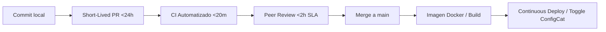
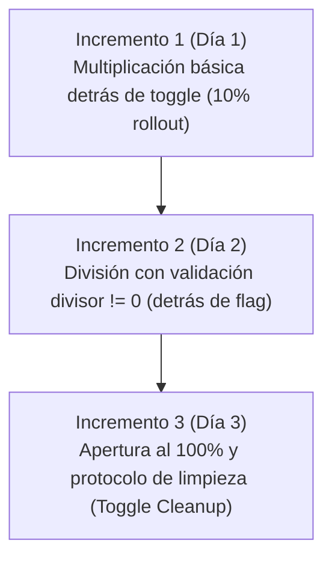

# 📘 Scrum + TBD Playbook
> **Adaptación de Scrum a entornos de Despliegue Continuo y Trunk-Based Development (TBD)**  
> *Artefacto vivo y operativo de trabajo en equipo — Consolidado con acuerdos del Taller 4*

---

## 🎯 1. Propósito y Contexto
Este Playbook establece los acuerdos de trabajo, responsabilidades, adaptación de ceremonias y criterios de calidad para que el equipo opere bajo el marco **Scrum** alineado con **Trunk-Based Development (TBD)** y **Despliegue Continuo (CD)**.

* **Objetivo:** Garantizar que la rama `main` esté **siempre verde, estable y potencialmente desplegable (releasable)** en cualquier momento, reduciendo los tiempos de ciclo, maximizando el flujo de valor y eliminando por completo el miedo al despliegue.

---

## 🚦 2. Diagnóstico del Flujo Actual (Mapa de Fricciones)
*Dinámica de diagnóstico continuo para identificar cuellos de botella y optimizar el rendimiento del pipeline.*



### Semáforo de Salud del Flujo
| Estado | Elemento del Flujo | Observaciones / Aprendizajes |
| :--- | :--- | :--- |
| 🟢 **Funciona Bien** | Commits locales frecuentes, tests automáticos y Docker build | Commits frecuentes locales, tests unitarios automáticos y build de imagen Docker en CI. |
| 🟡 **Genera Fricción** | Ramas de mediana/larga duración | Ramas abiertas por más de 24 horas que acumulan conflictos y riesgo de integración. |
| 🔴 **Rompe Flujo / Miedo** | Cuello de botella en autorizaciones de merge | Dependencia de aprobaciones burocráticas o revisiones tardías que frenan el despliegue diario. |

> **Preguntas Clave del Equipo:**
> 1. *¿Cuánto tiempo vive normalmente una rama de desarrollo en nuestro repo?* (Meta TBD: `< 24 horas`).
> 2. *¿Qué tan seguido integramos realmente a `main`?* (Meta: al menos 1 vez al día por desarrollador).
> 3. *¿Nuestro Definition of Done (DoD) y Definition of Ready (DoR) garantizan que `main` sea desplegable a producción de forma segura?*

---

## 🧭 3. Los 5 Principios de Oro (Scrum + TBD)
1. **`main` es Sagrado y Siempre Releasable:** Ningún cambio que rompa pruebas o la compilación permanece en `main`. Si `main` se rompe, arreglarlo es la prioridad #1 de todo el equipo.
2. **Small Batches (Lotes Pequeños):** Dividir el trabajo en rebanadas verticales (*slicing*) tan pequeñas que puedan integrarse en cuestión de horas (< 24h), no días.
3. **Desacoplar Despliegue de Liberación (*Deploy vs Release*):** Usar **Feature Toggles / Flags** (ConfigCat) para desplegar código incompleto a producción de forma segura sin exponerlo a los usuarios finales.
4. **Calidad Integrada en el Pipeline (CI como Árbitro):** Las pruebas automatizadas, linters y análisis de seguridad son los guardianes de la calidad antes y después del merge.
5. **Responsabilidad Colectiva:** Todo el equipo es dueño de la estabilidad de producción, de la fluidez del pipeline y del rápido desbloqueo de PRs.

---

## 👥 4. Roles Adaptados a TBD + Continuous Deployment

```
┌────────────────────────────────────────────────────────────────────────┐
│                        RESPONSABILIDADES DE ROL                        │
├─────────────────┬────────────────────────────┬─────────────────────────┤
│  Product Owner  │         Developers         │      Scrum Master       │
│                 │                            │                         │
│ • Prioriza por  │ • Mantienen main verde     │ • Facilita disciplina   │
│   valor y batch │ • Lotes pequeños (<24h)    │   de integración diaria │
│ • Define flags  │ • Ownership del pipeline CI│ • Elimina el miedo a    │
│ • Slicea con el │ • Monitorean producción    │   romper main           │
│   equipo        │ • Fast Code Reviews (<2h)  │ • Registra Lead Time PR │
└─────────────────┴────────────────────────────┴─────────────────────────┘
```

### Compromisos Individuales (*Acuerdos del Taller*)
* **Product Owner:**
  * [x] Dividiré historias en bloques de 1 día y usaré Feature Toggles en ConfigCat para desacoplar despliegues de lanzamientos comerciales.
* **Developers:**
  * [x] No dejaré ramas abiertas más de 24 horas y revisaré las Pull Requests de mis compañeros en menos de 2 horas para evitar cuellos de botella.
  * [x] Realizaré commits atómicos con pruebas locales y asumiré la responsabilidad inmediata de reparar el pipeline de CI si un merge genera fallos.
* **Scrum Master:**
  * [x] Centraré las Daily Scrums en destrabar integraciones a main, registraré el Lead Time de PRs (<24h) y eliminaré bloqueos en permisos de GitHub.

---

## 🔄 5. Artefactos y Ceremonias: Clásico vs. TBD + CD

| Artefacto / Ceremonia | Versión Clásica | Adaptación TBD + CD | Guía de Acción en el Equipo |
| :--- | :--- | :--- | :--- |
| **Product Backlog** | Lista de historias grandes por funcionalidad completa. | Historias sliceadas + plan de **Feature Toggles** + Criterios de Aceptación verificables en producción. | Escribir historias pensadas en activación progresiva (*Dark launching / Toggles*). |
| **Sprint Backlog** | Compromiso de paquetes cerrados de trabajo al final del sprint. | Flujo de trabajo continuo ordenado por valor y riesgo que se integra a `main` diariamente. | Medir rendimiento por *Cycle Time* y estabilidad de ramas en lugar de estimaciones rígidas. |
| **Incremento** | Paquete de software entregable solo al final del Sprint. | **Cada commit en `main` que pasa CI es un Incremento potencial listo para producción.** | El valor se entrega continuamente a lo largo del Sprint. |
| **Sprint Planning** | Planificación enfocada en estimar puntos de historia. | Planificación enfocada en **estrategia de Slicing, capacidad realista y arquitectura de flags**. | Definir el Sprint Goal desacoplado y el plan de integración diaria (Día 1 a N). |
| **Daily Scrum** | "¿Qué hice ayer? ¿Qué haré hoy? ¿Qué impedimentos tengo?" | **"¿Qué voy a integrar hoy a `main` y qué necesito del equipo para que sea seguro y rápido?"** | Foco total en destrabar PRs, code reviews y mantener `main` verde. |
| **Sprint Review** | Demo tradicional en ambiente local o staging del trabajo acumulado. | **Demo de lo que ya está en producción activando/desactivando flags en vivo con ConfigCat.** | Demostrar funcionalidades en vivo con datos reales y telemetría de producción. |
| **Sprint Retrospective** | Enfoque exclusivo en dinámicas de equipo y comunicación. | **Mejora del flujo de valor + salud del pipeline + disciplina TBD + métricas DORA.** | Analizar fallos de CI, tiempo de vida de PRs y tiempos de code review. |

---

## 📋 6. Definition of Ready (DoR) Orientada a TBD
Para que una historia o incremento pueda ingresar al **Sprint Backlog** durante el Refinamiento o Sprint Planning, debe cumplir obligatoriamente con los siguientes **5 criterios mínimos de salud TBD**:

- [ ] **1. Slice ≤ 1 día:** La historia está dividida verticalmente de modo que pueda implementarse, integrarse a `main` y pasar CI en menos de 24 horas de trabajo.
- [ ] **2. Acceptance Criteria verificables en producción:** Criterios de aceptación testeables una vez desplegado el código en vivo (no limitados únicamente a pruebas en entornos locales o aislados).
- [ ] **3. Feature Toggle definido:** Se estableció explícitamente si requiere flag, la clave técnica en ConfigCat (ej. `isFeatureNameEnabled`) y el porcentaje inicial de rollout (ej. `10%` pruebas internas).
- [ ] **4. Cero dependencias bloqueantes externas:** La tarea no depende de ramas abiertas de otros desarrolladores ni de componentes incompletos en progreso.
- [ ] **5. Estrategia de validación acordada:** El equipo y el Product Owner tienen definido claramente cómo y con qué datos se verificará la funcionalidad en vivo una vez desplegada.

---

## ✅ 7. Definition of Done (DoD) Adaptada
Para que una historia o incremento se considere **Done**, debe cumplir con:

### ⚙️ Criterios Técnicos
- [ ] Código desarrollado en una rama de vida corta (< 24h).
- [ ] Pruebas unitarias e integración añadidas y pasando en local y en CI (`pytest`).
- [ ] Linter y análisis estático aprobados sin warnings críticos (`flake8`, etc.).
- [ ] Code Review aprobado por al menos 1 par (< 2h SLA).
- [ ] **Merged a `main` exitosamente y pipeline de CI en verde.**
- [ ] Si la funcionalidad está incompleta o en fase de validación: protegida detrás de un **Feature Flag en ConfigCat**.

### 💼 Criterios de Negocio y Operación
- [ ] Criterios de Aceptación validados con el Product Owner en producción o staging representativo.
- [ ] Feature Flag configurado y testeado en apagado/encendido (*Dark Launching*).
- [ ] Logs y métricas básicas implementadas para observar el comportamiento.
- [ ] Documentación técnica o de API actualizada si aplica.

---

## 📅 8. Planificación de Sprint Orientada a Flujo

### 🎯 Formato de Sprint Goal Orientado a TBD
El Sprint Goal debe reflejar la entrega continua de valor desacoplando el despliegue del lanzamiento comercial:

> **Plantilla:**  
> *"Al final del sprint los usuarios podrán **[Capacidad X]**, aunque **[Funcionalidad Y]** todavía esté protegida detrás de toggle en ConfigCat."*

* **Ejemplo Real del Equipo:**
  > *"Al final del sprint los usuarios podrán **ejecutar operaciones de resta en la calculadora de forma estable**, mientras que **las operaciones avanzadas (multiplicación/división) estarán integradas en producción al 10% detrás de ConfigCat** para validación interna."*

---

### 📊 Reglas de Orden del Sprint Backlog
1. **Criterios de Ordenación:** Los ítems del backlog se ordenan balanceando:
   $$\text{Prioridad} = \text{Valor de Negocio} + \text{Riesgo de Integración} + \text{Dependencia Técnica}$$
2. **Regla de Oro:** **El primer ítem del Sprint Backlog debe poder integrarse a `main` el Día 1 o Día 2 del sprint.** Queda prohibido postergar todas las integraciones hacia el final del ciclo.

---

### 🗺️ Matriz de Plan de Integración Diaria
| Ventana Temporal | Foco del Incremento | Objetivo de Integración en `main` | Estado en ConfigCat |
| :--- | :--- | :--- | :--- |
| **Día 1 - 2** | *Resta UI & Backend + Base Multiplicación* | Primer merge a `main` con tests en verde. Estructura de flag inicial. | `isSubtractionEnabled` al 100%<br>`isAdvancedOpsEnabled` al 10% (interno) |
| **Día 3 - 4** | *División con validaciones de seguridad* | Segundo merge a `main` con manejo de excepciones (divisor $\neq 0$). | `isAdvancedOpsEnabled` al 10% - 50% |
| **Día 5+** | *Estabilización, Rollout 100% y Cleanup* | Liberación general a usuarios y eliminación de deuda técnica/toggles obsoletos. | `isAdvancedOpsEnabled` al 100% $\rightarrow$ Flag deprecado / Limpieza |

---

### ⏳ Ajuste de Capacidad Realista (Buffer & Overhead TBD)
Para evitar la sobrecarga y asegurar que el código fluya sin fricción hacia producción, se descuenta de la capacidad bruta:
* **2 horas diarias por desarrollador:** Dedicadas exclusivamente a **Fast Code Reviews (< 2h SLA)** y desbloqueo de PRs de pares.
* **20 minutos por commit/PR:** Para la ejecución y monitoreo del **Pipeline de CI** (linters, pruebas unitarias y Docker build).
* **Colchón para la Regla de los 10 Minutos:** Reserva de tiempo para atención prioritaria inmediata si `main` llega a romperse.

---

## 🛠️ 9. Técnicas de Sliceado Vertical (Template y Caso Real)

### 📋 Plantilla Oficial de Slicing (Taller 4)
Toda historia compleja debe descomponerse utilizando la siguiente estructura estándar:

```markdown
* **Título formal:** [tipo]: [descripción concisa de la rebanada vertical]
* **Descripción:** [Qué capacidad conecta de punta a punta: UI + Backend + CI]
* **Corte Vertical (Slice para TBD):** [Alcance exacto integrable a main en < 24h]
* **Estrategia de Feature Toggle:** [Nombre del flag en ConfigCat + % rollout inicial]
* **Criterios de Aceptación (AC) en Producción:**
  1. [Comportamiento verificable 1 en UI/API]
  2. [Comportamiento condicional con ConfigCat (ON/OFF)]
  3. [Rollout y público objetivo inicial]
  4. [Pipeline CI en verde: tests, linters y Docker build aprobados]
```

---

### 🔬 Caso Real: Re-sliceado de Operaciones Avanzadas en 3 Incrementos Diarios
Descomposición vertical de la historia riesgosa de *Operaciones Avanzadas (Multiplicación y División)* en micro-incrementos diarios:



#### 🔹 Incremento 1 (Día 1): Multiplicación Básica detrás de Toggle
* **Título formal:** `feat: conectar multiplicacion() en frontend bajo feature toggle`
* **Descripción:** Conectar interfaz de usuario y backend para realizar multiplicaciones aritméticas básicas.
* **Corte Vertical (Slice para TBD):** Implementación completa de multiplicación (UI + Lógica + Test) integrada a `main` en <24h, oculta para usuarios generales.
* **Estrategia de Feature Toggle:** Flag `isAdvancedOpsEnabled` en ConfigCat con **rollout inicial al 10%** (usuarios de prueba interna).
* **Criterios de Aceptación en Producción:**
  1. La operación `multiplicar(a, b)` ejecuta correctamente y muestra resultado en UI para usuarios habilitados.
  2. Para el 90% restante de usuarios, la opción no es visible ni interactiva.
  3. Tests unitarios en verde cubriendo casos base. CI 100% aprobado en `main`.

#### 🔹 Incremento 2 (Día 2): División con Validación de Seguridad
* **Título formal:** `feat: conectar division() con validacion de divisor cero bajo toggle`
* **Descripción:** Incorporar la operación de división asegurando validación de divisor diferente de cero (`b != 0`).
* **Corte Vertical (Slice para TBD):** Integración de lógica de división, manejo de error/alerta en UI y pruebas de división por cero en <24h.
* **Estrategia de Feature Toggle:** Reutiliza `isAdvancedOpsEnabled` en ConfigCat, manteniendo el rollout en **10% - 25%**.
* **Criterios de Aceptación en Producción:**
  1. La operación `dividir(a, b)` calcula correctamente cuando $b \neq 0$.
  2. Mensaje de error claro en UI si $b = 0$, sin romper el estado de la aplicación.
  3. Cobertura de pruebas unitarias para divisiones válidas e inválidas en CI.

#### 🔹 Incremento 3 (Día 3): Apertura al 100% y Protocolo de Limpieza (*Toggle Cleanup*)
* **Título formal:** `feat: liberar operaciones avanzadas al 100% y remover feature toggle`
* **Descripción:** Habilitación general de multiplicación y división para todos los usuarios y remoción del código condicional.
* **Corte Vertical (Slice para TBD):** Incremento de rollout al 100% en ConfigCat, validación de métricas de error y PR de limpieza de deuda técnica eliminando el flag.
* **Estrategia de Feature Toggle:** `isAdvancedOpsEnabled` al **100%**, seguido de eliminación del flag en código y en ConfigCat.
* **Criterios de Aceptación en Producción:**
  1. El 100% del tráfico accede a multiplicación y división de forma fluida.
  2. Cero incremento en tasas de error en producción.
  3. Código refactorizado: `if (flag)` eliminado, código limpio y tests actualizados. Flag archivado en ConfigCat.

---

## 📌 10. Acuerdos Técnicos y Decisiones para el Próximo Sprint

| Tema / Compromiso | Estado / Decisión Definitiva | Responsable | Meta / SLA |
| :--- | :--- | :--- | :--- |
| **Filtro DoR en Refinamiento** | **Ninguna historia ingresa a Planning sin pasar los 5 criterios de salud TBD** (Tamaño ≤ 1 día, Verticalidad, Toggle definido, Cero bloqueos y Validación acordada). | Product Owner / Developers | 100% de historias listas |
| **Medición de Flujo (Lead Time)** | **El Scrum Master registrará el Lead Time de las PRs** (desde apertura de PR hasta merge a `main`), detectando demoras en revisiones. | Scrum Master | **Merge a `main` < 24h** |
| **Branch Protection** | Modificación en GitHub Rulesets: eliminar aprobación exclusiva del Admin y reemplazarla por **Peer Review obligatorio (1 Developer)** + **CI en verde obligatorio** antes del merge a `main`. | Tech Lead / DevOps | Inmediato / Activo |
| **SLA de Code Reviews** | Compromiso de revisión y feedback de Pull Requests en un tiempo máximo estipulado. | Developers | **< 2 horas SLA** |
| **Gestor de Feature Flags** | **Adopción definitiva de ConfigCat** con convención estándar (`isFeatureNameEnabled`) y protocolo de limpieza post-release. | Developers / Tech Lead | En uso constante |
| **Pipeline CI (GitHub Actions)** | Automatización obligatoria de linters, pruebas unitarias (`pytest`) y build de imagen Docker en cada PR y push a `main`. | DevOps / Developers | Pipeline < 20 min |

---

## 🚀 11. Regla de Emergencia: `main` Roto
Si un commit en `main` rompe el pipeline de CI:
1. **Detener nuevos merges:** Nadie integra a `main` hasta que el pipeline esté completamente verde.
2. **Regla de los 10 minutos:** Si el fix no se identifica y corrige en 10 minutos, se ejecuta **`git revert`** del commit causante de forma inmediata.
3. **Investigar en local:** El desarrollador replica e investiga el problema en su entorno local con pruebas unitarias antes de volver a someter una PR.
